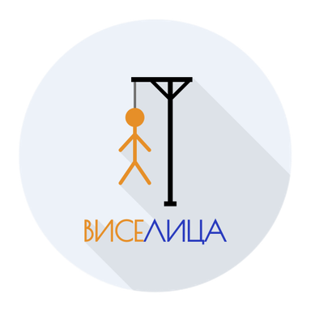
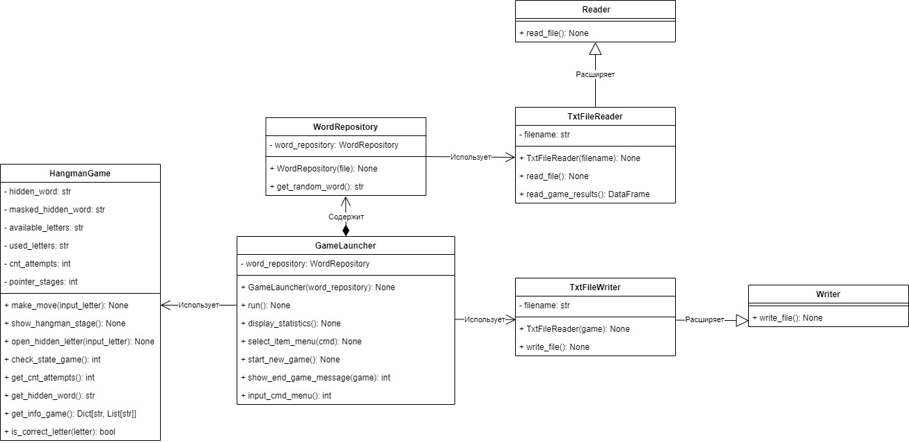
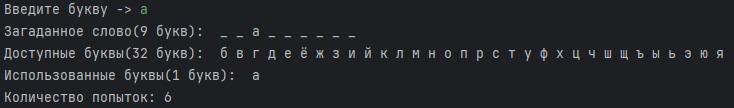
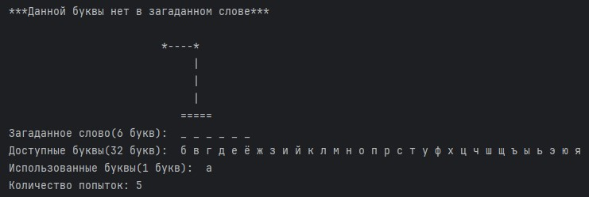
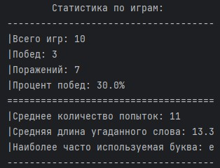

# Игра "Виселица"

"Виселица" - это игра, в которой случайным образом загадывается слово, а игрок пытается его угадать, для этого он
предлагает букву, которая может входить в загаданное слово.
Если такая буква есть в слове, то она отображается — столько раз, сколько встречается в слове. Иначе, за каждый
неправильный ответ добавляется одна часть туловища к виселице. Игрок имеет 6 попыток.
Если туловище в виселице нарисовано полностью, то игрок проиграл. Если игроку удаётся угадать слово, он выигрывает.

Проект создан в рамках **Python Roadmap Сергея Жукова** -> [ссылка](https://zhukovsd.github.io/python-backend-learning-course/)

  

## Структура проекта

* [main.py](main.py) Файл, позволяющий запустить игру
* [src/data](src/data) Директория, содержащая в себе текстовый словарь слов существительных, используемых в игровом
  процессе
* [src/word_repository.py](src/word_repository.py) Класс, позволяющий генерировать случайное слово на основе списка слов
* [src/game_launcher.py](src/game_launcher.py) Содержит класс, позволяющий организовать игровой процесс
* [src/analyzer.py](src/analyzer.py) Содержит класс, который позволяет выполнить анализ проведенных игр
* [src/views/view.py](src/views/view.py) Содержит в себе консольное представление игры
* [src/game_logic/game.py](src/game_logic/game.py) Содержит в себе класс, содержащий логику игры
* [src/game_logic/hangman_stages.py](src/game_logic/hangman_stages.py) Файл, позволяющий получить состояния виселицы
* [src/file_handlers/read_word_file.py](src/file_handlers/read_word_file.py) Класс, позволяющий выполнить чтение файла
* [src/file_handlers/write_game_result.py](src/file_handlers/write_game_result.py) Класс, позволяющий записать результат
  проведенной игры

## Диаграмма классов

## Процесс

1. Выполните команду `pip install -r requirements.txt` в терминале
2. Начните игру выполнив `python3 main.py` в терминале.
3. На экране появится главное меню игры, введите команду `1` для начала игры.

   

4. После начала игры введите предполагаемую букву.
    - Если буква присутствует в слове, она отобразится — столько раз, сколько она встречается в слове

   

    - Иначе добавится одна часть туловища к виселице и количество попыток уменьшится на 1

   
5. У вас есть 6 попыток, для того чтобы угадать слово.
6. Для отображения статистики по проведенным играм введите команду `2` в меню   
   
## Возможные улучшения проекта
* Добавление локализации под разные языки
* Добавление уровня сложности для игры
## Стек

* Python 3.11
* Pandas 2.2.1
