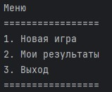

# Игра "Виселица"

"Виселица" - это игра, в которой случайным образом загадывается слово, игрок пытается его угадать, для этого он предлагает букву, которая может входить в это слово. 
Если такая буква есть в слове, то она отображается — столько раз, сколько она встречается в слове. Иначе, за каждый неправильный ответ добавляется одна часть туловища к виселице. Игрок имеет 6 попыток. 
Если туловище в виселице нарисовано полностью, то игрок проиграл. Если игроку удаётся угадать слово, он выигрывает.
## Screenshots

## Процесс

1. Начните игру выполнив `python3 main.py` в терминале.
2. На экране появится главное меню игры, введите команду `1` для начала игры.

3. После начала игры введите предполагаемую букву.
   - Если буква присутствует в слове, она отобразится — столько раз, сколько она встречается в слове
   - Иначе добавится одна часть туловища к виселице и количество попыток уменьшится на 1
4. У вас есть 6 попыток, для того чтобы угадать слово.

## Структура проекта

* [main.py](main.py) Файл, позволяющий запустить игру
* [data](data) Директория, содержащая в себе текстовый словарь слов существительных, используемых в игровом процессе
* [src/word_repository.py](src/word_repository.py) Класс, позволяющий генерировать случайное слово на основе списка слов
* [src/view.py](src/view.py) Содержит в себе консольное представление игры
* [src/read_file.py](src/read_file.py) Класс, позволяющий выполнить чтение файла
* [src/hangman_stages.py](src/hangman_stages.py) Файл, позволяющий получить состояния виселицы
* [src/game_launcher.py](src/game_launcher.py) Содержит класс, позволяющий организовать игровой процесс
* [src/game.py](src/game.py) Класс, содержащий логику игры

## Стек

* Python 3.11
